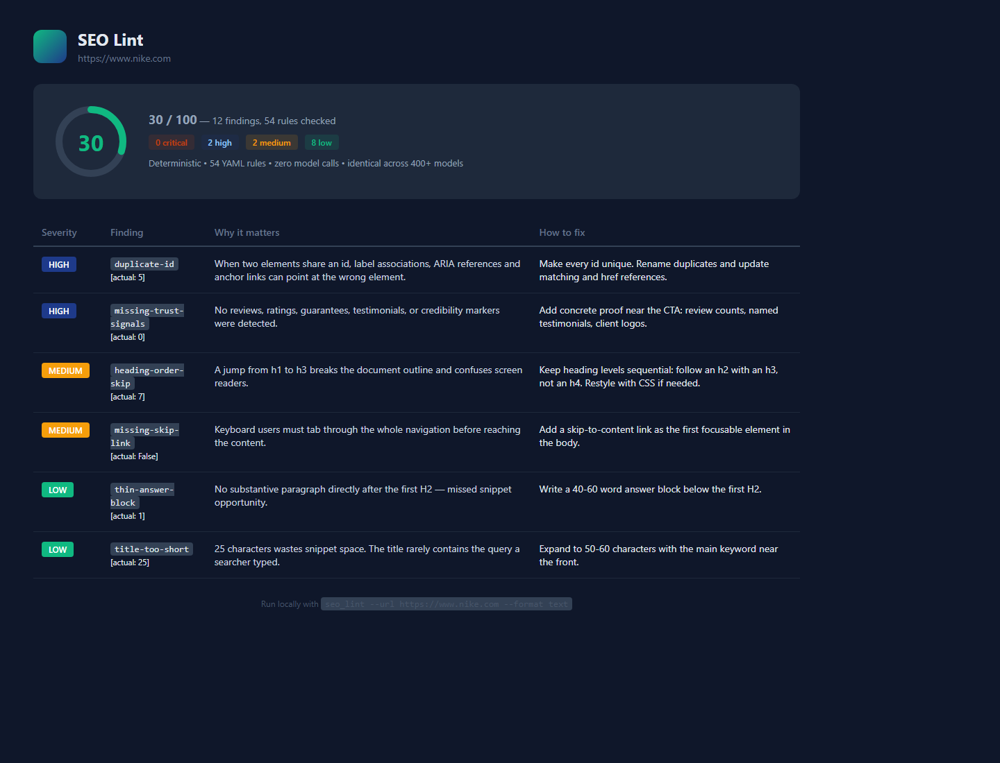
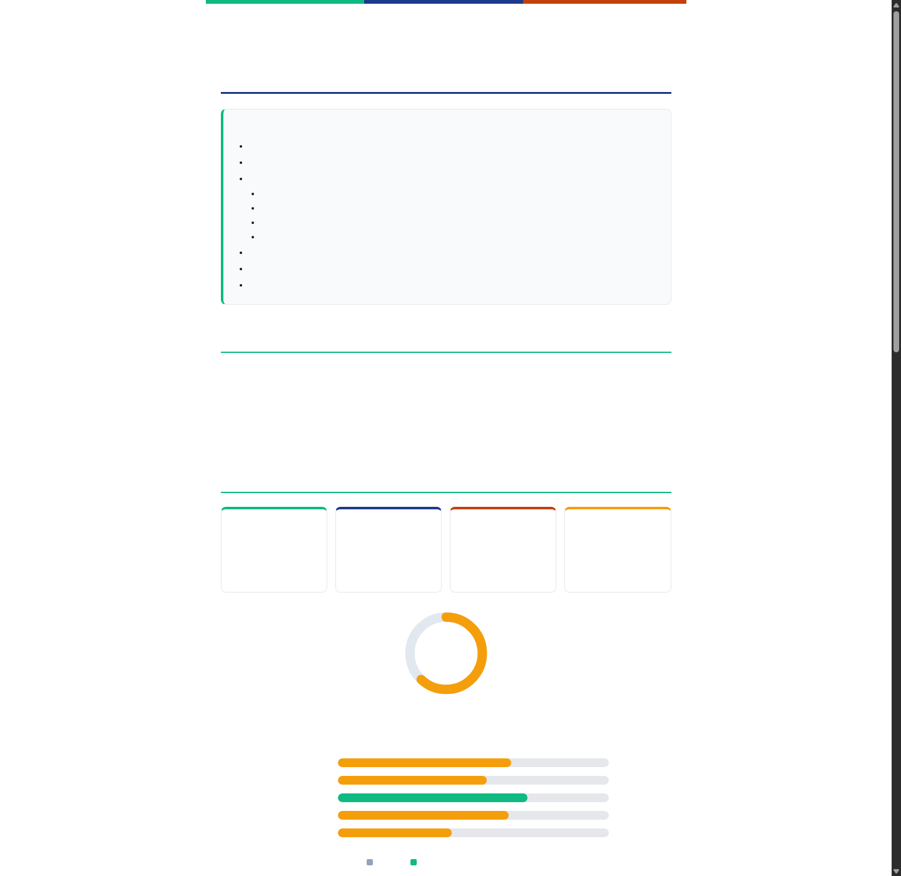
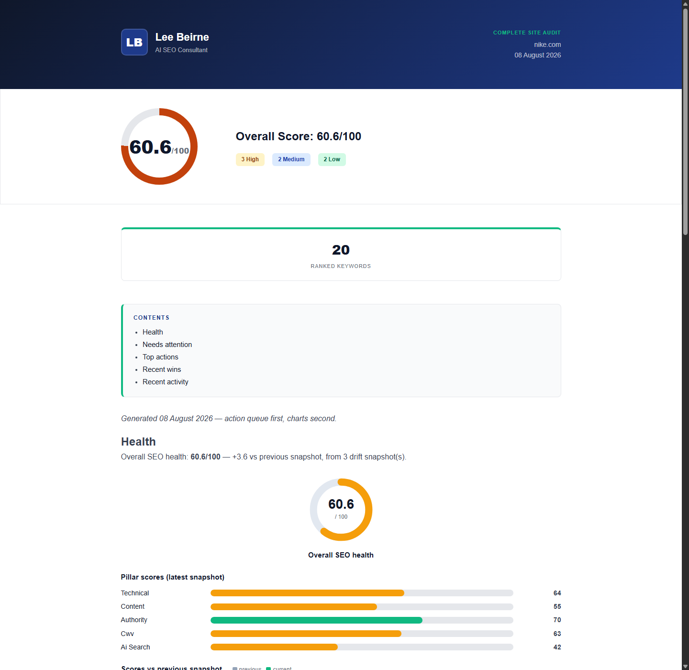

# OpenCode SEO Suite

[](https://github.com/venomous2/opencode-seo/actions/workflows/ci.yml)
[](LICENSE)
[](tests)
[](rules)
[](https://openrouter.ai/)

**Turn OpenCode into an SEO consultant that never hallucinates numbers.**

Audit websites, find ranking opportunities, optimise for AI search, monitor
competitors, apply automatic fixes, and produce client-ready reports — all
powered by live [DataForSEO](https://dataforseo.com) data and a
deterministic rule engine that gives identical answers across all
[OpenRouter.ai](https://openrouter.ai/) models.

Every number is sourced. Every recommendation has a "why". Every report is
ready to send.

> **New user?** Start with [docs/GETTING-STARTED.md](docs/GETTING-STARTED.md)
> (15 minutes to your first audit + monitoring), then keep
> [docs/USER-GUIDE.md](docs/USER-GUIDE.md) — every command, the stores,
> and a page of tips — by your side.

## Just ask

You don't need to memorise commands. Talk to OpenCode naturally:

> Why has my traffic dropped?
>
> Audit nike.com and compare me to adidas.com
>
> What should I publish next in the coffee niche?
>
> How visible am I in ChatGPT and Perplexity?
>
> Does this landing page match what people expect for "CRM pricing"?
>
> Fix the SEO issues on my pricing page
>
> Create a content calendar for next month
>
> Why don't I rank for "best espresso machine"?
>
> Review this pull request for SEO regressions

The `seo-suite` orchestrator figures out which skill or workflow to run.

## How it works

```
You ask a question
        |
seo-suite orchestrator chooses a workflow
        |
Four specialist agents run in parallel
  (technical / content / competitive / AI-search)
        |
The rule engine validates every finding (54 rules, zero model calls)
        |
DataForSEO enriches with live volumes, rankings, backlinks
        |
Recommendations prioritised — with the "why" and the fix
        |
Branded HTML report, executive one-pager, or chat answer
```

## What it looks like

**Deterministic lint** — real output, Nike.com homepage:



**Branded audit report** — charts, findings, recommendations, one command:



**Mission-control dashboard** — health, action queue, wins, activity:



## The differentiator: deterministic engine

Most AI SEO tools say "the model thinks this might be an issue."

This suite says "this *is* an issue, here is the evidence, and here is
the exact fix."

54 SEO checks live as structured YAML rules with embedded tests, evaluated
in pure Python with **zero model calls**. That means:

- **Tested** — every rule has expect-pass/expect-fail fixtures
- **Identical** across all 400+ OpenRouter.ai models — the engine doesn't
  care which LLM runs the skill
- **CI-compatible** — `--min-score` exits non-zero, so you can fail a
  build on SEO regressions
- **Patchable** — the fix engine turns mechanical findings into concrete
  HTML patches with `.bak` backups
- **PR-reviewable** — `--format github` emits inline annotations; copy
  [examples/seo-pr.yml](examples/seo-pr.yml) for a merge-blocking check

AI provides the reasoning. Python provides the truth.

## Who it's for

- **Freelance SEO consultants.** Run a full audit on the discovery call, deliver a branded report with charts and a one-pager the same afternoon. The cost ledger keeps your DataForSEO spend visible per client.
- **Agencies.** Repeatable audit cadence across a client portfolio — same checks, same scoring, same report format every time, with drift snapshots proving progress between engagements.
- **In-house marketers.** Lint pages before they ship, gate releases with `--min-score` in CI, and monitor rankings drift monthly instead of discovering drops in the quarterly review.

## Install

**Windows (PowerShell):**
```powershell
git clone https://github.com/venomous2/opencode-seo.git
powershell -ExecutionPolicy Bypass -File opencode-seo\install.ps1
```

**macOS / Linux:**
```bash
git clone https://github.com/venomous2/opencode-seo.git
bash opencode-seo/install.sh
```

Then **restart OpenCode** and verify:
```bash
python scripts/seo_config.py status   # DataForSEO status .... READY
```

Full guide: [INSTALL.md](INSTALL.md) · Credentials: [docs/DATAFORSEO-SETUP.md](docs/DATAFORSEO-SETUP.md) · Google tiers: [docs/GOOGLE-APIS.md](docs/GOOGLE-APIS.md)

## Quick start

```
/site-audit https://example.com        # full audit, 4 specialist agents
/keyword-research best espresso beans  # live volumes, ideas, clusters
/new-post "pour over vs french press"  # research → publish-ready brief
/serp-analysis "crm for freelancers"   # who ranks and why
/keyword-gap example.com               # keywords competitors rank for, you don't
/citation-check https://example.com/guide  # AI citation readiness
/content-refresh example.com           # triage decaying content at scale
/sxo https://example.com/guide "target keyword" buy  # SERP-fit + landing experience
/schema article                        # generate JSON-LD
```

SXO methodology, evidence boundaries and page-type classification:
[docs/SXO.md](docs/SXO.md).

## Fail bad SEO in CI

The rule engine runs fully offline — no DataForSEO account or secrets
needed:

```yaml
- name: SEO quality gate
  run: python scripts/seo_lint.py --dir ./dist --min-score 80
```

On GitHub, go further: copy [examples/seo-pr.yml](examples/seo-pr.yml)
into your repo and every PR gets **inline findings on the Files tab** plus
a score-delta comment. Details: [docs/CI-AND-PR.md](docs/CI-AND-PR.md).

## How it compares

| | Manual audit | Commercial SEO tools | OpenCode SEO Suite |
|---|---|---|---|
| **Time per audit** | 4-8 hours | 30-60 min crawl + review | 10-15 min |
| **Cost** | Senior hours | £99-£999/month subscription | Free (MIT) + pennies of DataForSEO spend |
| **Client report** | You write it yourself | Dashboard or generic PDF | Branded HTML + executive one-pager, one command |
| **CI quality gate** | No | No | Yes — `--min-score` exit codes |
| **Auto-fixes** | No | No | Mechanical patches with `.bak` backups |
| **PR review bot** | No | No | Inline annotations on every pull request |
| **AI-search readiness** | Depends on the analyst | Typically 6-12 months behind | 10 dedicated skills + citation scoring |
| **Monitoring** | Manual | Per-domain subscription | Scheduled watch, recommendation queue, morning briefing |
| **Where your data lives** | Your spreadsheet | The vendor's cloud | Your machine |

Commercial crawlers are excellent at being crawlers; the suite doesn't try
to replace them. It adds what they don't do: judgment, workflows, fixes,
monitoring, and the report you actually send the client.

## At a glance

| Metric | Value |
|---|---|
| Skills | 88 |
| Slash commands | 12 |
| Deterministic rules | 54 (self-testing, YAML) |
| Specialist agents | 4 (run in parallel) |
| DataForSEO endpoints | 17 instant + full crawl |
| Schema types generated | 18 |
| OpenRouter.ai models | 400+ (identical results) |
| Rule engine model calls | 0 |
| Data cost | Pay-as-you-go (pennies per query) |

## The skill map

| Collection | Skills |
|---|---|
| **Foundation** | `site-audit` `technical-seo` `on-page-seo` `metadata-optimizer` `heading-optimizer` `internal-linking` `external-linking` `canonical-review` `robots-advisor` `sitemap-builder` |
| **Content** | `keyword-research` `search-intent-analysis` `topic-clustering` `topical-authority-planner` `content-calendar` `pillar-page-designer` `supporting-content-planner` `content-brief` `faq-generator` `entity-extraction` `content-review` `content-refresh` `thin-content-detector` `duplicate-content-review` `readability-analysis` `semantic-seo` `nlp-optimization` `eeat-review` `fact-verification` `content-gap-analysis` |
| **Technical** | `schema-generator` `schema-validator` `core-web-vitals` `javascript-seo` `crawl-budget` `redirect-analysis` `url-structure-review` `image-seo` `mobile-seo` `international-seo` |
| **AI Search** | `ai-overviews-optimization` `ai-mode-optimization` `chatgpt-citation-optimizer` `perplexity-optimization` `gemini-optimization` `llm-citation-readiness` `answer-engine-optimization` `retrieval-optimization` `knowledge-graph-enhancement` `entity-seo` |
| **Competitive** | `competitor-audit` `serp-analysis` `keyword-gap` `backlink-opportunity-planner` `content-opportunity-finder` `topical-coverage-comparison` |
| **Local & Commerce** | `local-seo` `gbp-advisor` `ecommerce-seo` `product-page-optimizer` `category-page-optimizer` |
| **Growth & PR** | `digital-pr-planner` `programmatic-seo` `news-seo` `video-seo` `parasite-seo-check` |
| **Experience** | `workflow-sxo` `cro-audit` `accessibility-audit` |
| **Monitoring** | `seo-drift` `seo-briefing` |
| **Automation** | `seo-report-writer` `seo-project-planner` `seo-task-generator` `seo-checklist-generator` `seo-roadmap-builder` |

## Architecture

```
You (chat / slash commands)
        |
  seo-suite orchestrator
       / \
  Workflows   Atomic skills   (87 total, orchestrated by intent)
       \ /
  4 specialist subagents (technical / content / competitive / AI-search)
        |
  Data layer (scripts/)
  |-- dfs_client.py     DataForSEO (mandatory)
  |-- google_client.py  Google APIs (optional)
  |-- rule_engine.py    54 YAML rules, zero model calls
  |-- seo_lint.py       ESLint for SEO
  |-- seo_fix.py        Fix engine
  |-- drift_store.py    Snapshots + diffs
  |-- recommend_store.py  Task queue with lifecycle
  |-- watch.py          Scheduled monitoring
  |-- sxo_analyser.py   Page-type + live SERP-fit baseline
  +-- project_memory.py Project context
```

Details: [docs/ARCHITECTURE.md](docs/ARCHITECTURE.md)

## FAQ

**How is this different from Screaming Frog or Ahrefs?**
Different jobs. Crawlers and link indexes give you raw data; the suite adds judgment on top: workflows, prioritised findings with the "why" attached, mechanical fixes, monitoring, and the client-ready report. Your data comes from DataForSEO's API — comparable to what the commercial tools charge subscriptions for — at pay-as-you-go prices, with a cache and cost ledger keeping spend visible.

**Do I need the Google APIs?**
No. DataForSEO alone powers everything. Google credentials are optional enrichment tiers: PageSpeed/CrUX field data, then Search Console, then GA4. See [docs/GOOGLE-APIS.md](docs/GOOGLE-APIS.md).

**What does DataForSEO actually cost me?**
Pennies per typical query (a keyword research session is usually well under $0.25). Every call is logged to the cost ledger (`python scripts/cost_ledger.py report`), and identical pulls within the cache TTL are free. Sandbox mode (`--sandbox`) costs nothing for testing.

**Does it work on JavaScript-heavy sites (React/Next/Vue)?**
The instant lint and on-page checks read the served HTML — if critical content only appears after JS rendering, run the DataForSEO crawl with `--javascript` so pages are rendered first. For most sites the default works fine. `seo_lint --render auto` detects SPAs and renders only when needed.

**Is my data private?**
Everything is local-first: credentials in `~/.config/opencode/seo-suite/` (user-only permissions) or your project's `.env`, reports in your `SEO_REPORTS_DIR`, nothing sent anywhere except the official DataForSEO and Google API endpoints.

**Which AI models does it work with?**
All of them. The rule engine and linting are deterministic Python — zero model calls — so results are identical across OpenRouter.ai models. Skills are plain markdown procedures; any model that can follow instructions can run them.

## Requirements

- [OpenCode](https://opencode.ai) (latest)
- Python 3.10+
- DataForSEO account ([register](https://app.dataforseo.com/register)) — pay-as-you-go, a few cents per typical query
- Optional: Google API key / service account for the enrichment tier

## License

MIT — see [LICENSE](LICENSE).

---

*Inspired by [`AgriciDaniel/claude-seo`](https://github.com/AgriciDaniel/claude-seo) — an original re-implementation for OpenCode, modified and extended by Lee Beirne (DataForSEO-mandatory data layer, three-layer architecture, project memory). All skill content is original; credit for the underlying concept goes to Agrici Daniel.*
